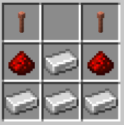
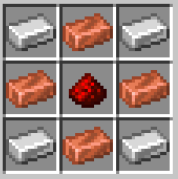

# Redstone routers
## Setup
### literally just put the Jar into the plugins folder of your server
## How to use it
### ok this one is more complex so first you place down the Redstone Router block which you can get 3 ways:
* left-click an existing Redstone Router to make it drop the item
* use
~~~~ 
/GetRedstoneRouter
~~~~ 
#### 3: craft it using the shown crafting recipe

### Now you want to get a Ping Block which you can get by
 * yet again left-click an existing Ping Block to make it drop the item
 * use
~~~~ 
/GetPingBlock
~~~~ 
* craft it but with this recipe

### Ok we have both of the blocks so heres how it works: <li> Every Redstone Router has a 6 digit ping ID (e.g. 568456). when you right-click the Redstone Router in chat it tells you the ID of that router <li> Then place down a Ping Block which is placed next to a Redstone Router and right click it. this will bring up a UI where you enter the PingID of the Redstone Router you want to ping <li> Finally the redstone signal sent into the Ping Block (including its signal strength) will come out the Redstone Router you pinged
## So thats how to use it
> **Warning:** THIS IS EXTREMLY BUGGY because I suck at programming and the way it works is very jank
### the development process is explained more <a href="https://pollaghan.github.io/Redstone-Routers/">here</a>
